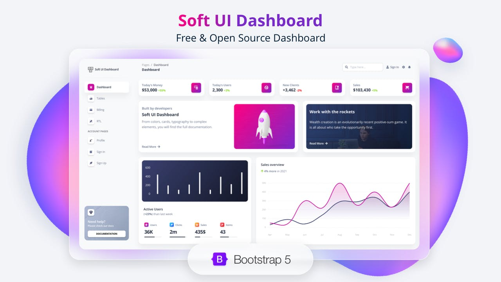

### Introduction

This project is a starter that helps you start your next project on VueJS, as it provides a lot of the common tools you may reach for, all ready to go.

### Features

- Vue Router Included.
- Vuex.
- Bootstrap 5.
- Modules/Components organized across folders.
- Base pages (like Dashboard/404 etc).
- Pre-configured with code quality tools: Prettier, Jest, etc.
- Axios Interceptors.
- [Soft UI](https://github.com/creativetimofficial/soft-ui-dashboard) included.
- [vue-notification](https://github.com/dafcoe/vue-notification) included.



### Requirements

Node Version: >=14.x.

### Installation

```console
npm install
cp .env.example .env
npm run dev
```
